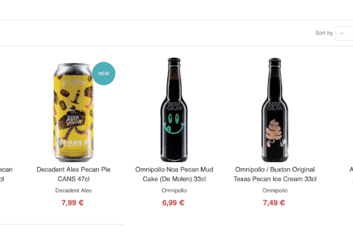

# Google Chrome "Search in Untappd" extension
It's as simple as it says - a Google Chrome extension that allows you to easily select text on a webpage and search it on untappd.com
## Cleaning search terms
This is the RegEx being used to clean up the selected text:

`\s*(can(s)?)?\s?(\d+([\.\,]\d+)?\s?([cdm]?)l)?\s*$`

Everyone else:
>  Why don't you just select the text you want to search for, then?

Well... I'm lazy. And depending on the website's layout, selecting text in links is not as straightforward as "just selecting the text I want". I want to right click, tap "search" and be done with it.

> What does that oddly (some might say unnecessary) RegEx do then?

Great question! Before I start though, let me split it into parts:

First, by getting rid of the initial `/ ____ /ig`, which makes it a global and case-insensitive search:

`\s*(can(s)?)?\s?(\d+([\.\,]\d+)?\s?([cdm]?)l)?\s*$`

Then, the outmost characters are there to remove trailing spaces, and make sure we're only searching for text at the end of the selected part `\s* _____ \s*$`:

`(can(s)?)?\s?(\d+([\.\,]\d+)?\s?([cdm]?)l)?`

Then, we search whether the text contains the word `can`, in singular, plural or in any capitalisation, as well as an optional space after it: `(can(s)?)?\s?`

`(\d+([\.\,]\d+)?\s?([cdm]?)l)?`

After that, we look for any indication of the beer's quantity (that may or may not be present, as indicated with the `( ___ )?`): `(\d+([\.\,]\d+)?\s?`, matching anything from a single digit (`1`, `2`, `400`) to decimals (`1.2`, `4.5`, `3,5`, etc.), as well as a trailing space after it.

`([cdm]?)l)?`

At last, we look for the beverage's unit of measurement (again, optional), currently only supporting the metric system (`cl`, `ml`, `dl`, `l`).

> Some people, when confronted with a problem, think “I know,
>
> I'll use regular expressions.”  Now they have two problems.
>
> \- Jamie Zawinski <jwz@netscape.com> wrote on Tue, 12 Aug 1997 13:16:22 -0700:

http://regex.info/blog/2006-09-15/247

## About untappd.com
From [Wikipedia](https://en.wikipedia.org/wiki/Untappd):
>Untappd is a geosocial networking service and mobile phone application that allows its users to check in as they drink beers, and share these check-ins and their locations with their friends.

The Untappd logo, and any other Untappd product or service names, trademarks, logos, or other indicia (“Marks”) that may appear on the Site are the property of Untappd or its subsidiaries, affiliates or third parties.
## Contributing
Fork, code, PR. [KISS](https://en.wikipedia.org/wiki/KISS_principle).
## License
[MIT License](./LiCENSE)
